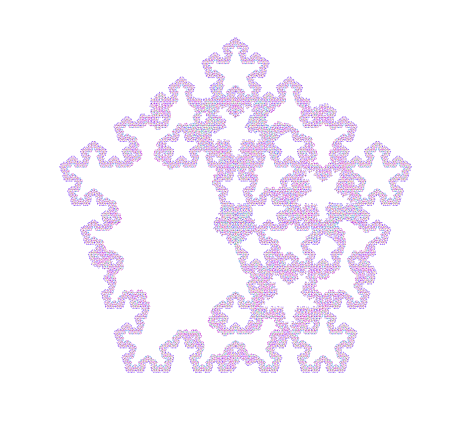
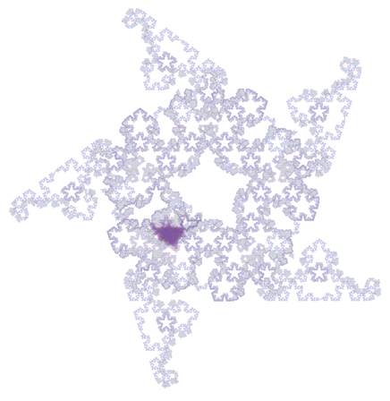

# Running Langton's ant on Penrose tiling

## Building

```
make
```

## Running

For full usage, run:

```
./bin/ant -h
```

## Example results

```
./bin/ant -o LLLRLRL 200000
```



```
./bin/ant -m 1024 -o RRLRRLRRRR.E90+C-99.5000000
```



## References

- [Langton's Ant on Penrose Tiling producing a Pentaflake-like Fractal (video) by dropped box](https://www.youtube.com/watch?v=vUdfcftF5cM)
- [Langton's Ant draws Koch Snowflake on Penrose Tiling (video) by dropped box](https://www.youtube.com/watch?v=D72Op1Z_VFQ)
- [Pattern Collider by Aatish Bhatia, Henry Reich](https://aatishb.com/patterncollider/)
- [Pattern Collider (GitHub)](https://github.com/aatishb/patterncollider)
- [Pentagrids and Penrose Tilings by Stacy Mowry, Shriya Shukla](https://web.williams.edu/Mathematics/sjmiller/public_html/hudson/HRUMC-Mowry&Shukla_Pentagrids%20and%20Penrose.pdf)
- [deBruijn Mathematical Details by Greg Egan](https://www.gregegan.net/APPLETS/12/deBruijnNotes.html)
