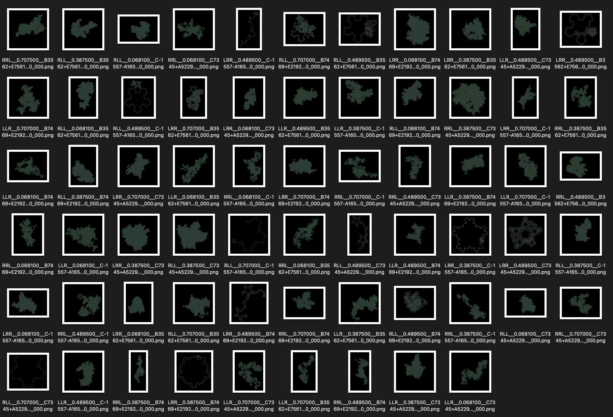

# Running Langton's ant on Penrose tiling

[](https://pkg.go.dev/github.com/ptiles/ant)
[](https://goreportcard.com/report/github.com/ptiles/ant)

## Building

```shell
make
```

## Running

For full usage, run:

```shell
./bin/ant-batch -h
```

```shell
./bin/ant -h
```

## Example results

```shell
./bin/ant -w 2048 -alpha LRR__0.641800__C-8152+D2139__2_500_000
```


```shell
./bin/ant -w 2048 -alpha LRR__0.246000__B5868-A7386__3_500_000_000
```


```shell
./bin/ant RLL__0.000007__D59542+A-67051__25_000_000_000
```


## Batch run

```shell
./bin/xargs-ant-batch -n LLR,LRR,RLL,RRL -ic 4 -rc 4 -d results_4_4_500k -s 500_000
```



```shell
./bin/xargs-ant-batch -n LLR,LRR,RLL,RRL -ic 8 -rc 8 -d results_8_8_500k -sc 200_000 -sm 500_000 -sn 200 -s 500_000
```


## References

- [Langton's Ant on Penrose Tiling producing a Pentaflake-like Fractal (video) by dropped box](https://www.youtube.com/watch?v=vUdfcftF5cM)
- [Langton's Ant draws Koch Snowflake on Penrose Tiling (video) by dropped box](https://www.youtube.com/watch?v=D72Op1Z_VFQ)
- [Pattern Collider by Aatish Bhatia, Henry Reich](https://aatishb.com/patterncollider/)
- [Pattern Collider (GitHub)](https://github.com/aatishb/patterncollider)
- [Pentagrids and Penrose Tilings by Stacy Mowry, Shriya Shukla](https://web.williams.edu/Mathematics/sjmiller/public_html/hudson/HRUMC-Mowry&Shukla_Pentagrids%20and%20Penrose.pdf)
- [deBruijn Mathematical Details by Greg Egan](https://www.gregegan.net/APPLETS/12/deBruijnNotes.html)
